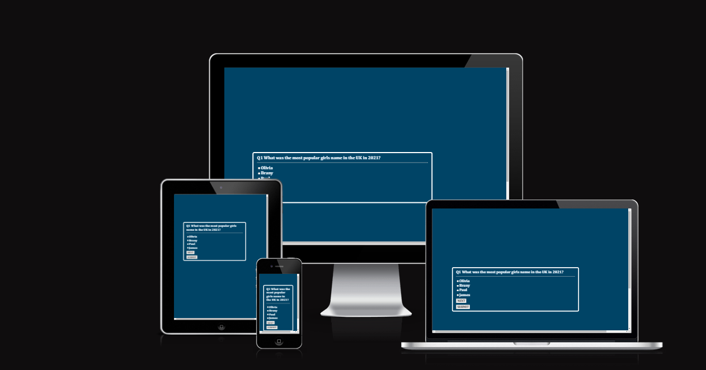
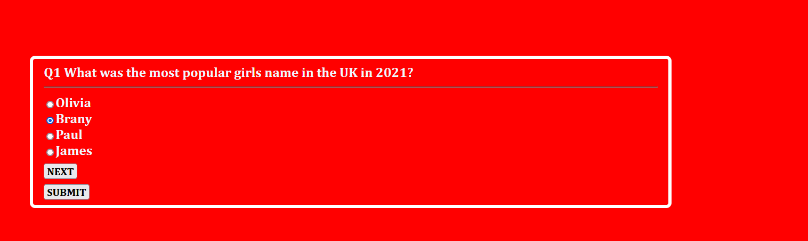
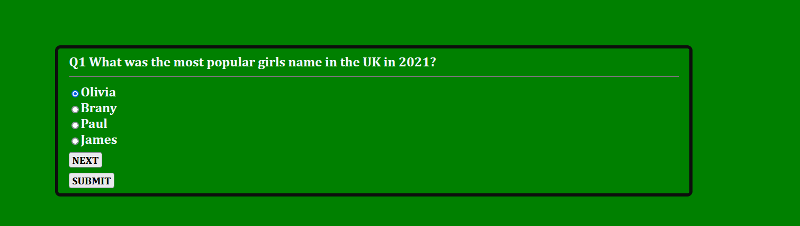
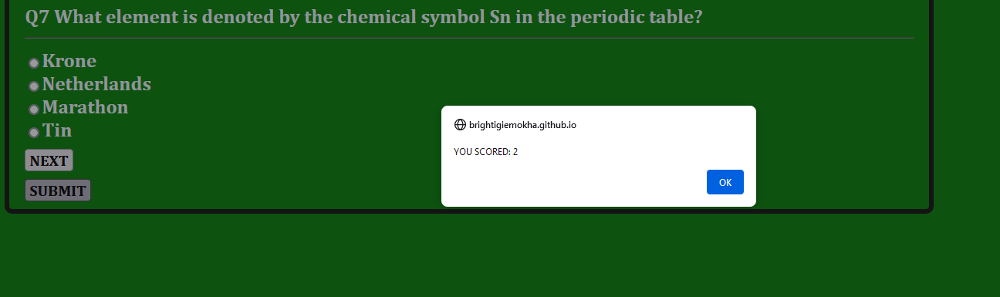
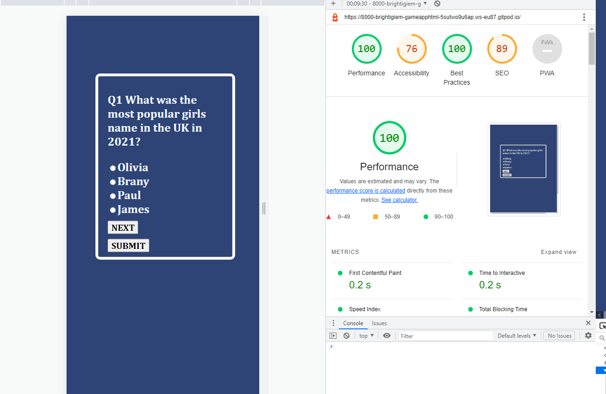
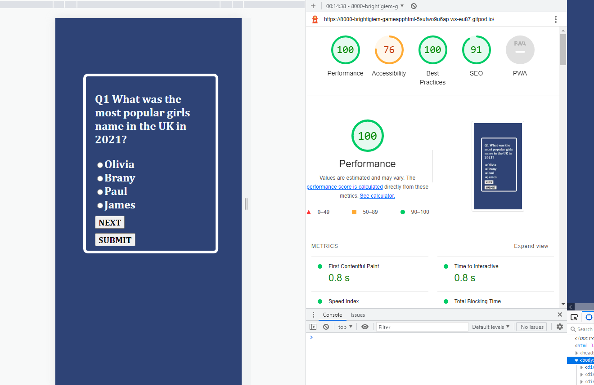
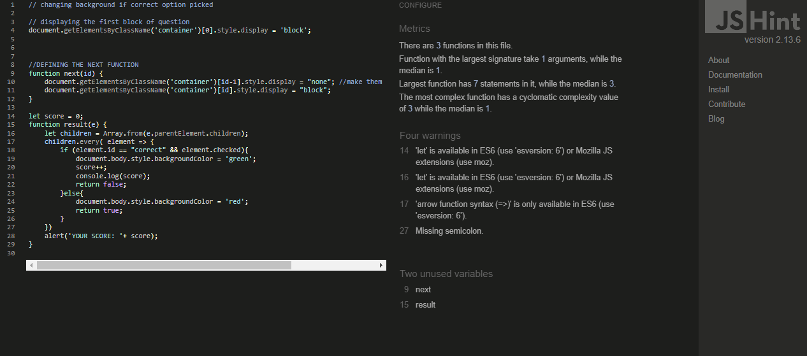

<h1>QUIZ APP</h1>

 this a quiz game with perfect background colour and completely responsive. there are 4 options to choose from and to make the game easier to answer a background color of red was set gto help user understand when they are making wrong choice and green background is shown when the right answer is picked. this is displaced below

  

 this game is very educative and exciting too.

<h2>Navigation</h2>
to navigate to the next question a Next button was created to help user move to next question when they are ready to continue. and a submit button is also included just incase the user choose to stop at any point and want to know what they scored.
when they click on the submit button there a new tab displaying your score. see below images of these.
 

<h3>LIGHTHOUSE</h3>

 page was tested on Lighthouse as well and below are pictures of the result 

 

<h4>JSHINT</h4>

 js code was also checked on Jshint and those where was some commnt but there was no error.

https://jshint.com/
 
 <h5>SPECIAL REF / APPRECIATION</h5>

all thanks to God the man of all and my blessed Lord and saviour Jesus christ for the grace he have give me to complete bthis project. 
I would us this opportunity to appreciate Bee Coder (https://www.youtube.com/watch?v=j9Elj5Sxfug) for the youtube video that gave me a fundation to this project.  
i also want to appreciate the code institute mentors who on a daily bases answered most of my question.
A big thank you to an amazing woman of God that stood to ensure i finished my project, Mrs Lucimeri Andretta and her Lovely Husband Marlos. God bless you both and your family.

<h6>ENJOY</h6>