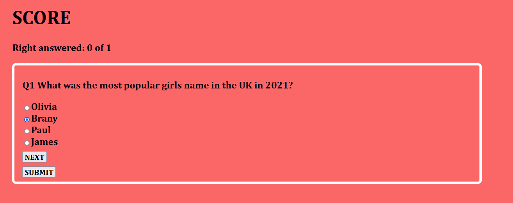
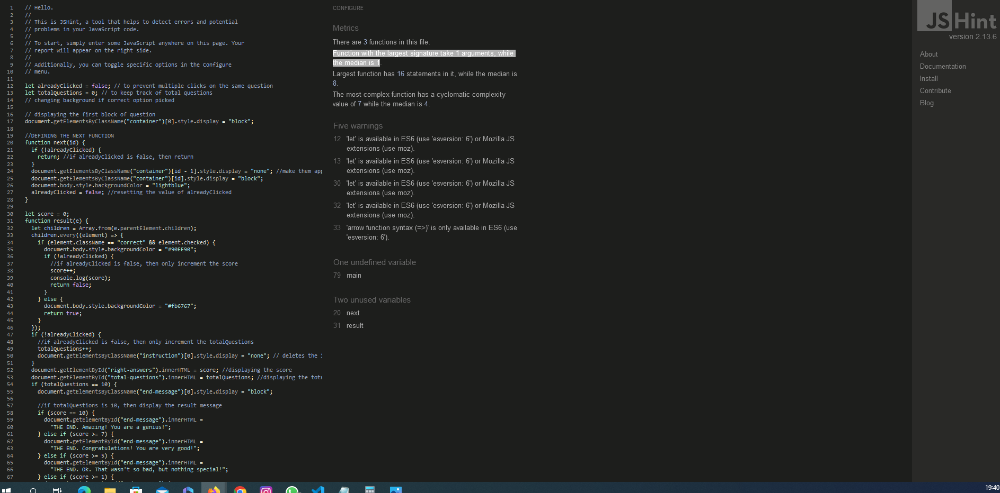

# Quiz App

Quiz app is a beautiful interactive and informative game for user's who would love to have fun and learn as the same time. game has a beautiful background and can be played on any device and its give score of how far a user have gone and deplay background colors based on the answer provided. 
you can't get bored playing this game.

## Features 

Quiz app have 10 questions with 4 options and 1 correct answer for each questions, when you pick the correct question and click the submit , you could click the refresh button to start a fresh section
### Existing Features

- __Quiz App Score's__

  - This section is where the score of the player is displayed it have the number of questions answered correctly and the number of game played in total.

 (./assets/image/scores.png)

- __The Game Area__

  - This is the questions area with a pecfect border to make the play area more attractive and separate from other sections. it has black texts and 4 options for ezch questions. 

 (./assets/image/playsection.png)

- __Correct Answer__

  - During the game when you pass the right answer you will get the a green background as a confirmation that you have passed that section.

- __Failed Scored__

  - During the game when the user picked the wrong answer you will get the a green background as a confirmation that you have passed that section.

For some/all of your features, you may choose to reference the specific project files that implement them.

In addition, you may also use this section to discuss plans for additional features to be implemented in the future:

- __Completely Responsive__
  - site is completely responsive and can be played on any device of the user's choice/choosen.

## Testing 

Site was tested to sure it run perfectly well. first it was tested for multiple score on 1 same questions. during the test i tried to answer 1 questions twice to see if it will add to the score but it didnt which is perfectly as intended. the submit and background color was tested to see if we can get the required background when i picked the right answer and wrong answer. it showed green backgound for correct answer and red background for wrong answer as intended.
the scores added one each time a correct answer was picked and no score was added when wrong choice was picked

site is completely responsive and can be played on any Browser / device of the user's choice/choosen..

I had issure with Duplicated ID. this was due to the fact that i have used one ID multiple times and i didnt have enough time to correct this as i saw this after i have finish my project and going over the correction would affect my entire project. site is running perfectly .

If this section grows too long, you may want to split it off into a separate file and link to it from here.

### Validator Testing 

- HTML
    - No errors were returned when passing through the official [W3C validator](https://validator.w3.org/nu/#textarea)
      
    
- CSS
    - No errors were found when passing through the official [(Jigsaw) validator](https://jigsaw.w3.org/css-validator/validator)
    

- JavaScript
    - No errors were found when passing through the official [Jshint validator](https://jshint.com/)
      - The following metrics were returned: 
      - Function with the largest signature take 1 arguments, while the median is 1
      - There are 3 functions in this file.
      - Function with the largest signature takes 2 arguments, while the median is 0.
      - Largest function has 16 statements in it, while the median is 8.
      - The most complex function has a cyclomatic complexity value of 7 while the median is 4.
      

### Unfixed Bugs

You will need to mention unfixed bugs and why they were not fixed. This section should include shortcomings of the frameworks or technologies used. Although time can be a big variable to consider, paucity of time and difficulty understanding implementation is not a valid reason to leave bugs unfixed. 

## Deployment

This section should describe the process you went through to deploy the project to a hosting platform (e.g. GitHub) 

- The site was deployed to GitHub pages. The steps to deploy are as follows: 
  - In the GitHub repository, navigate to the Settings tab 
  - From the source section drop-down menu, select the Master Branch
  - Once the master branch has been selected, the page will be automatically refreshed with a detailed ribbon display to indicate the successful deployment. 

The live link can be found here - https://8000-brightigiem-quizapphtml-03gn55w0tkw.ws-eu95.gitpod.io/

## Credits 

special Thanks to Web Dev Simplified for his video that gave me the background to this project.[https://www.youtube.com/watch?v=riDzcEQbX6k]

### Content 

- The text for the Home page was taken from Wikipedia Article A
- Instructions on how to implement form validation on the Sign Up page was taken from [Specific YouTube Tutorial](https://www.youtube.com/)
- The icons in the footer were taken from [Font Awesome](https://fontawesome.com/)

### Media

- The photos used on the home and sign up page are from This Open Source site
- The images used for the gallery page were taken from this other open source site

Congratulations on completing your Readme, you have made another big stride in the direction of being a developer! 

## Other General Project Advice

Below you will find a couple of extra tips that may be helpful when completing your project. Remember that each of these projects will become part of your final portfolio so it’s important to allow enough time to showcase your best work! 

- One of the most basic elements of keeping a healthy commit history is with the commit message. When getting started with your project, read through [this article](https://chris.beams.io/posts/git-commit/) by Chris Beams on How to Write  a Git Commit Message 
  - Make sure to keep the messages in the imperative mood 

- When naming the files in your project directory, make sure to consider meaningful naming of files, point to specific names and sections of content.
  - For example, instead of naming an image used ‘image1.png’ consider naming it ‘landing_page_img.png’. This will ensure that there are clear file paths kept. 

- Do some extra research on good and bad coding practices, there are a handful of useful articles to read, consider reviewing the following list when getting started:
  - [Writing Your Best Code](https://learn.shayhowe.com/html-css/writing-your-best-code/)
  - [HTML & CSS Coding Best Practices](https://medium.com/@inceptiondj.info/html-css-coding-best-practice-fadb9870a00f)
  - [Google HTML/CSS Style Guide](https://google.github.io/styleguide/htmlcssguide.html#General)

Getting started with your Portfolio Projects can be daunting, planning your project can make it a lot easier to tackle, take small steps to reach the final outcome and enjoy the process! 
